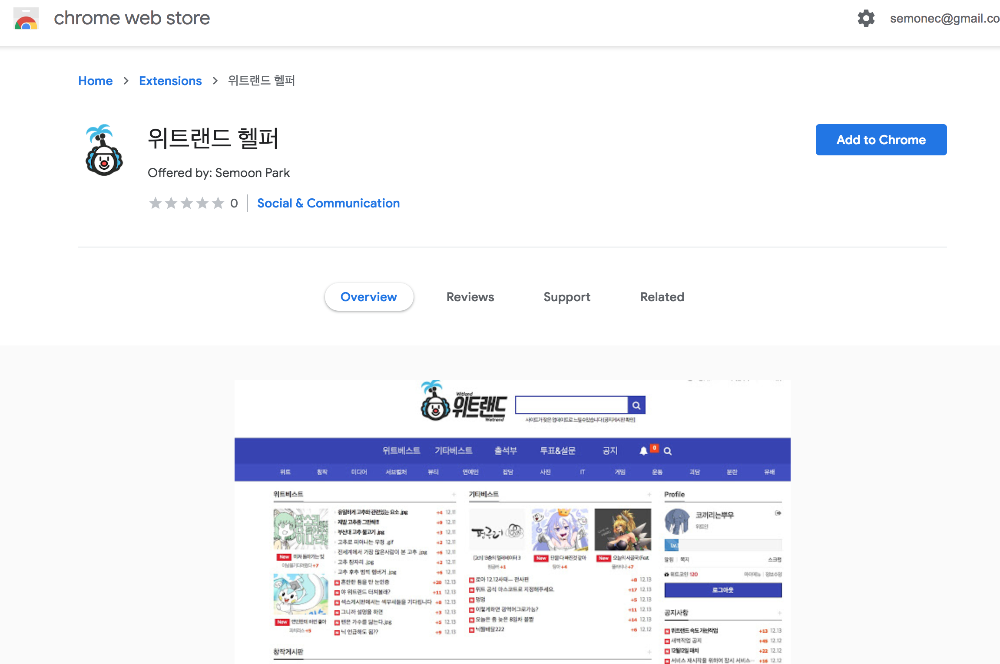
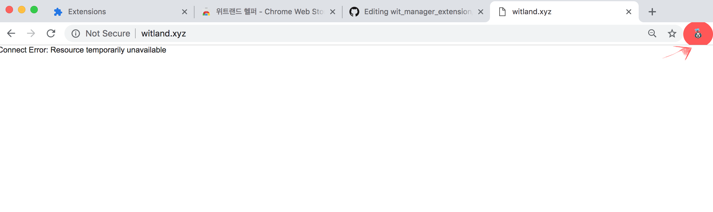

# Wit land Helper Extension

위트랜드 위터들을 위한 헬퍼입니다.

_made by 코끼리는뿌우_

## 설치 방법

https://bit.ly/2C9zz5q

위 링크에 접속 하신 후에 

위 스크린샷에서 보이는 **Add to Chrome** 버튼, 혹은 **Chrome에 추가** 버튼을 눌러주시면 됩니다.

## 기능 설명

- 주소창 옆 확장프로그램 영역 내 위트랜드 아이콘 클릭 시 위트랜드로 접속합니다

- 사이트 접속 시 아래의 부가 기능들이 활성화 됩니다.

## 게시글 읽기
게시글에 들어가면 좌측 하단에 파란 메뉴버튼이 생겨납니다.
이 버튼을 클릭하게 되면 다음 보조 메뉴 버튼들이 보여지게 됩니다.

- 댓글로 이동
  - 댓글쓰는 란으로 자동으로 스크롤시켜줍니다.
  - ~~설정창에서 스크롤 속도를 조절할 수 있습니다!~~ _아직 구현중...TBD_
- 추천하기
  - 추천버튼 찾아 헤맬 필요 없이 그냥 뙇!
- 비추천하기
  - 추천하기만 넣기 뭐해서.....
  - 광고글이나 뭐 기타 등등의 경우에만 쓰세요
- 설정 이동
  - ~~게시글에 접근 시 수행하는 부가기능들을 정의합니다. (자동추천, 자동 댓글, 기타등등)~~ _아직 구현중...TBD_

## TBD

계속 개발은 할건데...
일하느라 바빠서...ㅠㅠ
육아도 바쁘고...
회사 프로젝트는 망해서 팀이 날라갈지도 모르는데....
헤헤헷 데헷데헷
공부나 할 겸사 시작한게 5달러 내고 계정도 등록하고...
5달러 도네 받을거야 하고 와이프한테 말은 했는데...
클라인형 하는거 보면 도네는 무슨 도네야...
그냥 재능기부하는거지 뭐.....
몰래 받았다 퉁치고 페이팔 어카운트에 들어있던 달러 보여줄려고...

